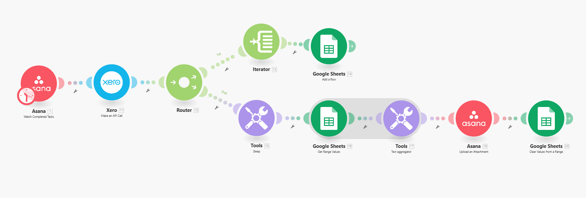

# -Asana-Xero-Report-Automation-Make.com-

## Goal
Automatically generate and attach a year-end Account Transactions report from Xero to an Asana task whenever that task is marked as complete.

## Why We Built This
Our client needed to automatically store a **General Ledger–style report** from Xero when tasks were completed in Asana.  
Since Xero's API does not support the "General Ledger Detail" report directly, we used the **Account Transactions** report as a reliable alternative.

This workflow:
- Detects when an Asana task is completed  
- Fetches last year's account transaction data from Xero  
- Formats it to match Xero's CSV export style  
- Attaches the CSV file back to the same Asana task automatically  

## How It Helps
- **No more manual downloading or uploading:** The workflow handles everything end-to-end.  
- **Accurate and consistent data:** Always fetches last year's data with correct formatting.  
- **Organized tasks:** Reports are attached directly to their relevant tasks in Asana.  
- **Time savings:** Team members no longer waste time running reports manually.  
- **Audit-ready:** All financial data is linked directly to project tasks for quick review.  

## Workflow Diagram

## Tools Used
- [Make.com](https://www.make.com) for automation  
- Asana API to detect completed tasks and upload attachments  
- Xero API to fetch account transaction data  
- Google Sheets for temporary formatting and CSV creation  

## How to Replicate
1. Connect Asana and Xero to Make.com.  
2. Use the included diagram and docs to build the scenario.  
3. Adjust date filters as needed (currently set for Jan 1 – Dec 31 of last year).  
4. Test by marking an Asana task complete — the CSV file should appear as an attachment.  

For full details on each module, see [docs/modules-explained.md](docs/modules-explained.md).  
For step-by-step setup instructions, see [docs/setup-guide.md](docs/setup-guide.md).
